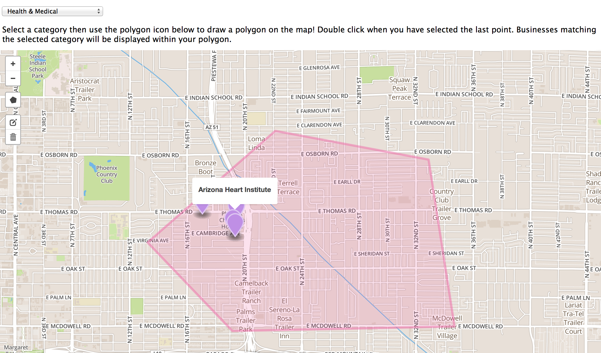

# Spatial Cypher Demo

This repo contains the client code the python scripts for importing data that power [this demo](http://www.lyonwj.com/scdemo/index.html)

The purpose of this is to give an example of what could be accomplished using Neo4j Spatial Cypher, a prototype implemented as part of a Google Summer of Code Project.

For more information, see this wiki:
[https://github.com/johnymontana/neo4j/wiki/tutorial#demo-app-finding-businesses-by-category-within-a-polygon](https://github.com/johnymontana/neo4j/wiki/tutorial#demo-app-finding-businesses-by-category-within-a-polygon)

## (Updated) Spatial Procedures

The new neo4j-spatial procedures allow for interfacing with neo4j-spatial using Cypher

~~~ js
function queryBusinesses(wkt, category) {
    var session = driver.session();
    session
        .run("CALL spatial.intersects('scdemo', {polygon}) YIELD node MATCH (c:Category {name: {category}})<-[:IN_CATEGORY]-(node) RETURN node.name AS name, node.longitude AS lon, node.latitude AS lat;", { category:category, polygon: wkt })
        .then(function(result){
            var r = [];
            console.log(result);
            result.records.forEach(function(record) {
                console.log(record._fields);
                r.push({lat: record.get("lat"), lon: record.get("lon"), name: record.get("name")});
                console.log(r);
            });
            session.close();
            console.log(r);
            dataToMarkers(r);

        })
        .catch(function(error) {
            console.log(error);
        });
}
~~~

## Dependencies

1. Neo4j
1. Node.js and npm

## Data

This project makes use of the Yelp! Academic dataset. The data is not distributed as part of this repository, but can be obtained [here]() and should be saved into the data/ directory once obtained.

To load the data:

1. `python yelp_import.py`
1. `python yelp_update_categories.py`
1. `python yelp_post.py`

See [this README]() for more information.

## Webapp

The `webapp/scdemo` directory contains the node.js web application for this project. Install node and npm first. Then:

1. `cd webapp/scdemo`
1. `npm install`
1. `./bin/www` -or- `npm start`

The map is powered by MapBox, please use your own API key.

## Neo4j server extension

The backend is powered by a Neo4j Server extension available [here](https://github.com/johnymontana/scdemo-extension).